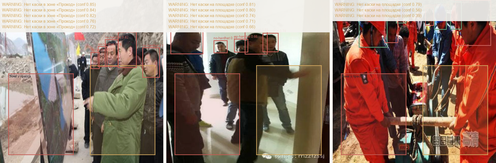

# PPE Safety Studio

Detect hard-hat compliance and flag intrusions into operator-defined danger zones — from a
single camera frame. YOLOv11 handles detection; a dependency-free geofencing layer turns raw
boxes into violations a safety officer can act on.

> **Open-source learning artifact, not a certified safety system.** It demonstrates the full
> CV lifecycle — data → fine-tune → evaluate → deploy — on open data. It does not replace a
> sertified промышленная система видеоаналитики, and it is not pitched against VizorLabs,
> Intenseye, or Mallenom. The Russian industrial market is structurally closed to a solo
> vendor here (КИИ 187-ФЗ, ФСТЭК certification, Указ-166); the value of this repo is engineering,
> not revenue.



## Why this is not "yet another YOLO helmet detector"

PPE detection is the most cloned YOLO tutorial on the internet. A bare detector signals nothing.
Three things make this a real artifact:

1. **Geofencing.** Detections are scored against polygon danger zones (normalized, resize-safe).
   A bare head *inside the press zone* is `CRITICAL`; the same head in a walkway is a site
   `WARNING`. Pure geometry, fully unit-tested — see [`src/ppe_studio/geofencing.py`](src/ppe_studio/geofencing.py).
2. **Multi-camera tracking.** ByteTrack (via Ultralytics) gives stable IDs across frames, so
   violations are per-person events, not per-frame noise.
3. **Honest evaluation.** Per-class mAP is generated by `eval.py` and pasted verbatim — no
   hand-tuned numbers, failure cases shown.

## Architecture

```
camera frame ─▶ YOLOv11 (Ultralytics) ─▶ Detection[] (normalized)
                                            │
                            configs/classes.yaml  (class → role)
                                            ▼
                       geofencing.evaluate() ◀─ configs/zones.yaml
                                            ▼
                              Violation[]  ─▶ Streamlit / overlay
```

The model layer is thin and swappable; all judgement lives in the testable geofencing layer.

## Quickstart

```bash
# 1. Env (GPU box: install CUDA torch first)
pip install torch torchvision --index-url https://download.pytorch.org/whl/cu124
pip install -r requirements.txt

# 2. Data — no API key needed. Pulls keremberke/hard-hat-detection from Hugging Face
#    and converts COCO → YOLO. Then set local_path: data/hardhat in configs/dataset.yaml.
python -m ppe_studio.data_nokey --out data/hardhat

# 3. Train (overnight on RTX 3080)
python -m ppe_studio.train --model yolo11s.pt --epochs 100

# 4. Evaluate — writes reports/metrics.json, prints the table for this README
python -m ppe_studio.eval --weights runs/ppe_yolo11s/weights/best.pt

# 5. Demo
streamlit run app.py
```

## Results

> _From `python -m ppe_studio.eval` on the 3,962-image val split. YOLO11s, 80 epochs._

| Class | mAP@50 | mAP@50-95 |
|---|---|---|
| hardhat | 0.942 | 0.557 |
| no-hardhat | 0.933 | 0.645 |
| **overall** | **0.937** | **0.601** |

Precision 0.91 · Recall 0.91. Dataset: keremberke/hard-hat-detection — Roboflow export of
Hard Hat Workers (train 13,782 / val 3,962 / test 2,001; 2 classes: `hardhat`, `no-hardhat`).
Hardware: single RTX 3080. Inference **2.9 ms/frame** (3.7 ms end-to-end) — real-time.

## Data & licensing

Pulled from Hugging Face (`keremberke/hard-hat-detection`) with no API key — the loader
downloads the COCO zips and converts to YOLO. The `no-hardhat` class is the violation
signal the geofencing layer keys on. To extend to vests/gloves (PPE v2), add the new class
roles in `configs/classes.yaml`; code reads roles from config and never hardcodes them.

## Limitations (read before judging)

- COCO-pretrained backbone fine-tuned on construction imagery — domain shift to heavy industry
  (smoke, glare, distance) degrades recall. Honest per-class numbers above show where.
- Helmet↔person association uses a cheap horizontal-overlap heuristic, not pose — it can miss
  occluded pairings. Documented on purpose.
- Not a КИИ-grade system: no SCADA/СКУД integration, no ФСТЭК certification, no audit trail.

## Tests

```bash
pip install -r requirements-dev.txt
pytest -q          # geofencing logic — no GPU needed
```

## Provenance

Topic #10 from the Innopolis industrial-CV research sprint (heavy-max, composite 10.0 —
strongest portfolio/visual of 21 industrial themes). Build spec and market context:
`../../research/topics/10_cv_ppe_safety_zones/150_synthesis_2026-06.md`.

## License

Code: MIT. Dataset: CC0 (Hard Hat Workers). Model weights: derived from CC0 data + Ultralytics
(AGPL-3.0 — note Ultralytics licensing if you redistribute weights commercially).

---

Telegram: [@vhodvai](https://t.me/vhodvai)
